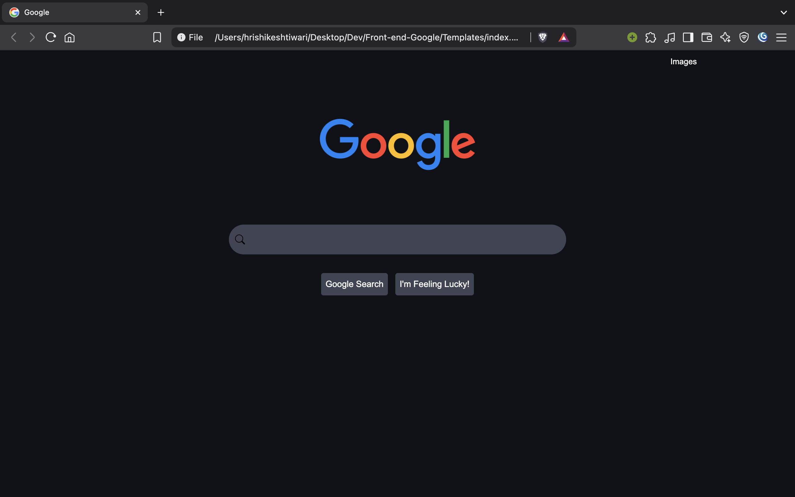
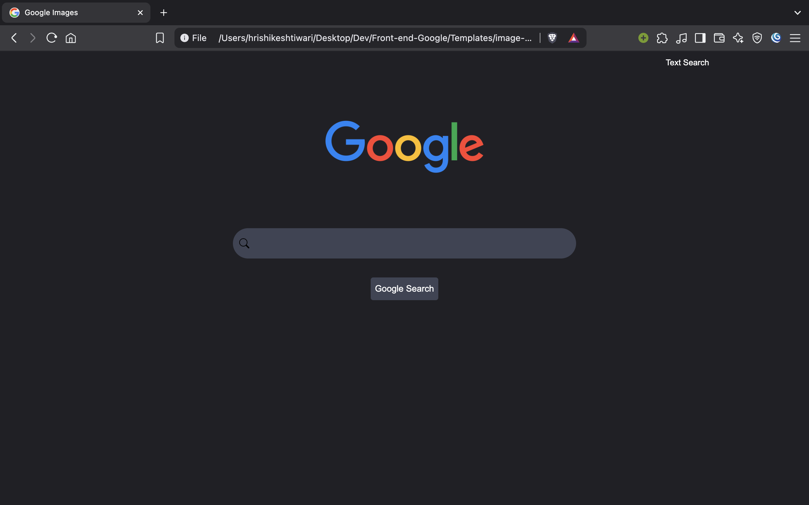

Hello, this is the assignment of CS50's Web Development Course out there on Youtube.

Here is the output of the code - 

1. The main google-search page

   

2. The image-search page of google images

   

